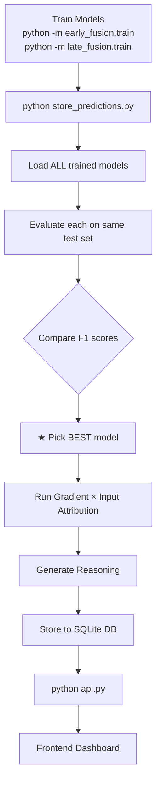

# Walkthrough: Test Data Storage + Model Comparison

## What Was Built

A shared pipeline that **compares all trained models**, **picks the best one**, generates **prediction reasoning**, and stores everything in a **SQLite database** for the frontend.

## Project Structure

```
D:\MINI_PROJECT\
├── api.py                 ← Shared FastAPI server (all models)
├── explain.py             ← Shared explainability (gradient × input)
├── store_predictions.py   ← Compare models → pick best → store to DB
├── early_fusion/
│   ├── config.py          ← Modified (TEST_SPLIT, DB_PATH, NORMAL_RANGES)
│   ├── dataset.py         ← Modified (two-stage split, returns test_metadata)
│   ├── train.py           ← Modified (unpacks test_metadata)
│   ├── model.py
│   ├── engine.py
│   ├── plots.py
│   └── artifacts/
│       ├── models/        ← early_fusion_model.pth
│       ├── predictions.db ← SQLite database
│       └── ...
├── late_fusion/           ← (future — just add to MODEL_REGISTRY)
└── requirements.txt       ← Added fastapi, uvicorn
```

## Pipeline Flow



## How to Use

```bash
# After training finishes:

# 1. Store predictions (compares models, picks best)
python store_predictions.py
python store_predictions.py --subset 500   # quick test

# 2. Start API
python api.py
# → http://localhost:5000/docs (Swagger UI)
```

## API Endpoints

| Endpoint | Description |
|----------|-------------|
| `GET /api/patients` | Patient list (paginated, filterable) |
| `GET /api/patients/{id}` | Full clinical data + prediction |
| `GET /api/patients/{id}/ecg` | 12-lead ECG waveform (loaded on-demand) |
| `GET /api/patients/{id}/insights` | Model reasoning with ranked explanations |
| `GET /api/metrics` | Aggregate model performance |
| `GET /api/stats` | Dashboard summary statistics |
| `GET /api/comparison` | Model comparison table |

## Adding Late Fusion (Future)

Just uncomment 8 lines in [store_predictions.py](file:///d:/MINI_PROJECT/store_predictions.py#L75-L86):

```python
MODEL_REGISTRY = {
    "early_fusion": { ... },
    "late_fusion": {                              # ← Uncomment
        "module":      "late_fusion.model",
        "class":       "LateFusionModel",
        "weights":     "late_fusion/artifacts/models/late_fusion_model.pth",
        "config": { ... },
        "dataset_module": "late_fusion.dataset",
    },
}
```

Then re-run `python store_predictions.py` — it will compare both and pick the winner.

## Files Changed

| File | Change | Lines |
|------|--------|-------|
| [config.py](file:///d:/MINI_PROJECT/early_fusion/config.py) | Added TEST_SPLIT, DB_PATH, NORMAL_RANGES, ECG_LEAD_NAMES | +28 |
| [dataset.py](file:///d:/MINI_PROJECT/early_fusion/dataset.py) | Two-stage split, data leakage prevention | ~40 changed |
| [train.py](file:///d:/MINI_PROJECT/early_fusion/train.py) | Unpack test_metadata | 1 line |
| [explain.py](file:///d:/MINI_PROJECT/explain.py) | NEW — shared explainability | 185 lines |
| [store_predictions.py](file:///d:/MINI_PROJECT/store_predictions.py) | NEW — compare + store | 310 lines |
| [api.py](file:///d:/MINI_PROJECT/api.py) | NEW — shared FastAPI | 310 lines |
| [requirements.txt](file:///d:/MINI_PROJECT/requirements.txt) | Added fastapi, uvicorn | +3 |
